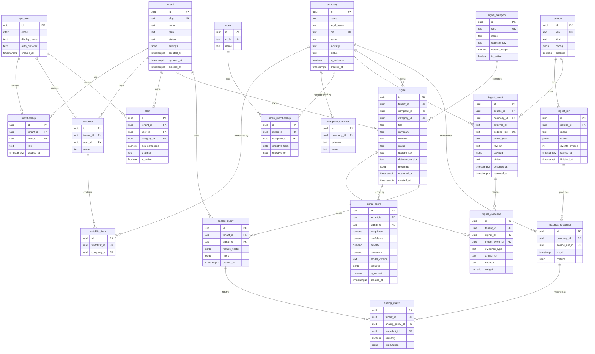

# Tickertea — Entity Relationship Diagram

Rendered with Mermaid. View in any Mermaid-capable viewer (GitHub, VS Code Mermaid preview).
Legend: shared/global entities are not tenant-scoped; everything referencing `tenant` is
tenant-scoped.

## Reading the diagram

- **Shared spine:** `company` ← `company_identifier` / `index_membership` / `ingest_event` /
  `historical_snapshot`. This is the market reality, identical for all tenants.
- **Tenant interpretation:** `signal` → `signal_evidence` → `signal_score`. Same evidence,
  per-tenant signals and scores.
- **Traceability path:** `signal_score` → `signal` → `signal_evidence` → `ingest_event` →
  `raw_uri` (S3). Any score traces all the way back to an immutable raw payload.
